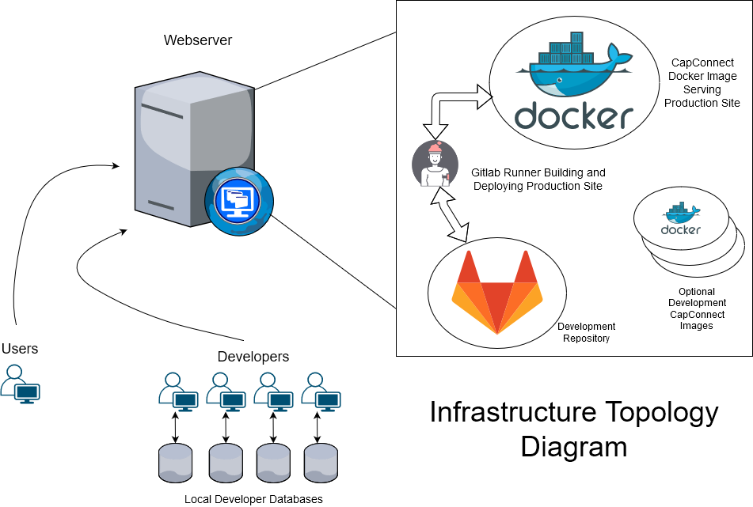
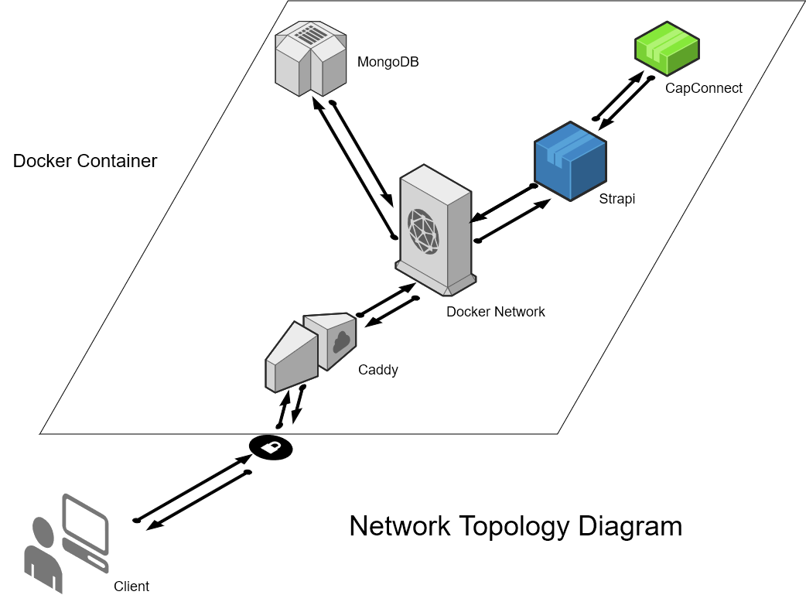
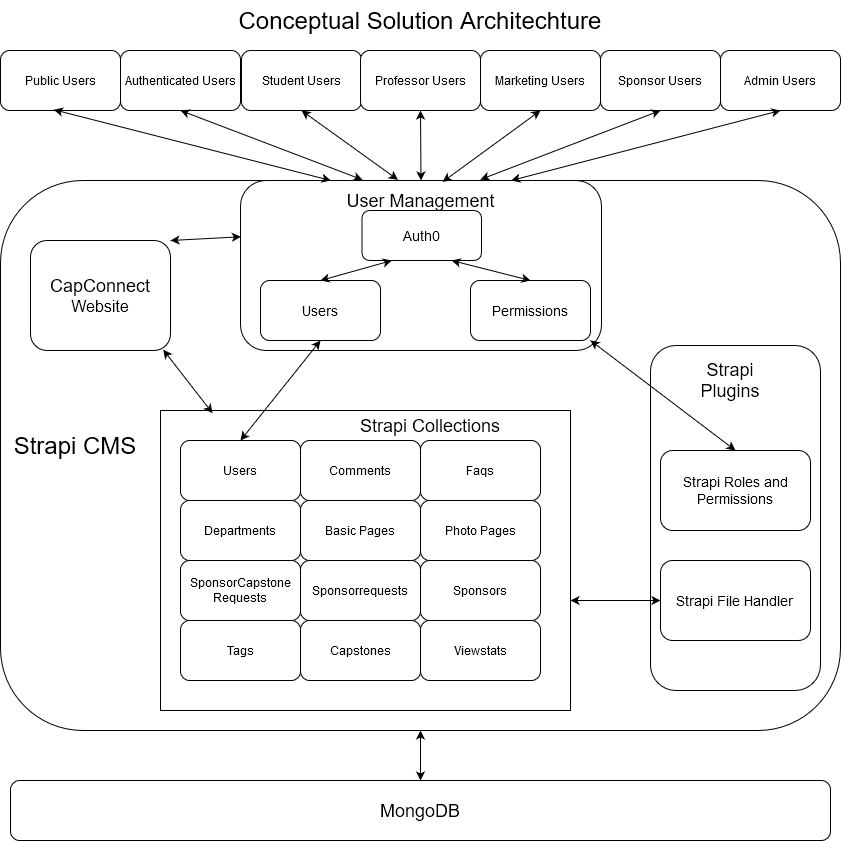

**Information Architecture Documentation**

**User Data Flow**

1. Users of CapConnect connect to the hosting webserver.
2. Traffic is routed by the webserver to the production docker image.
3. This production docker image takes the requests, processes them, and serves web pages back to the user.

**Developer Data Flow**

Developers have a variety of options with which they can interact with the webserver.

1. They could act as a user and navigate the production site.
2. They could access the locally hosted GitLab instance for development purposes.
3. They could optionally access the development docker images for testing.

**Code Data Flow**

1. Code committed on the development repository Master branch is picked up by the GitLab Runner.
2. This commit is then built and will replace the Strapi and Production website in the Docker image.
3. The production database will remain intact.

**Data Flow Inside the Production Docker Image**

1. Traffic is routed with HTTPS by the hosting webserver to Caddy. Strapi does not use HTTPS so all outside traffic is routed through Caddy for added security.
2. Once traffic is inside the Docker network, traffic is routed through to the Strapi instance.
3. From here, data from requests can go from the Strapi instance to the MongoDB via the Docker network, or it can go to the CapConnect Production Website via the Docker network.
4. Once the traffic is processed by Strapi, all outbound traffic is routed back to Caddy
5. Once back at Caddy, the data is then sent by Caddy to the appropriate client.

**Conceptual Data Flow**

1. Requests from all Users start with the User Management portal.
2. Auth0 authenticates the user with its users and the users stored in the Strapi Users collection.
3. Once authenticated, the User Management pulls the role and permissions for the particular user and provides that information to Strapi.
4. Strapi then takes this user information and adjusts what the user can see on the CapConnect Website.
5. If the user requests information from the website, Strapi handles the request for information, connecting (if needed) to the Strapi File Handler and the MongoDB instance to pull requested data.
6. This requested data is then formatted in JSON by Strapi and is handed off to the CapConnect Website for display to the user.

